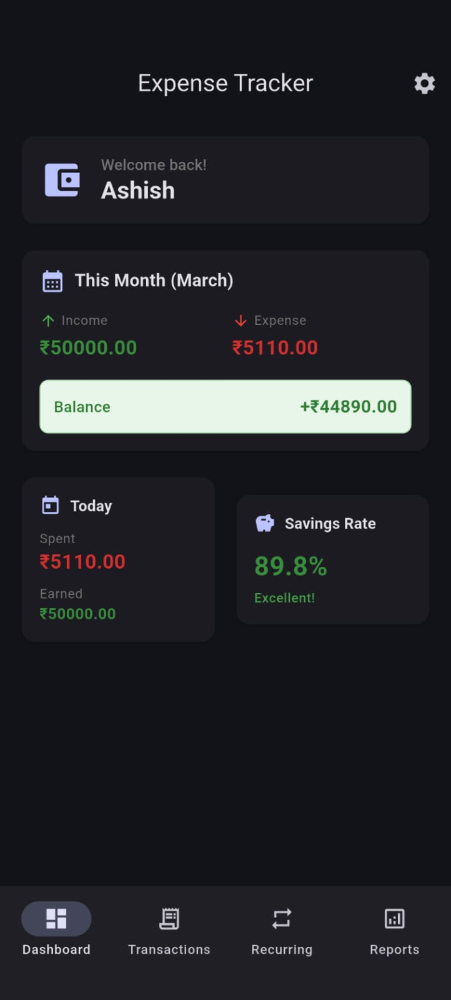
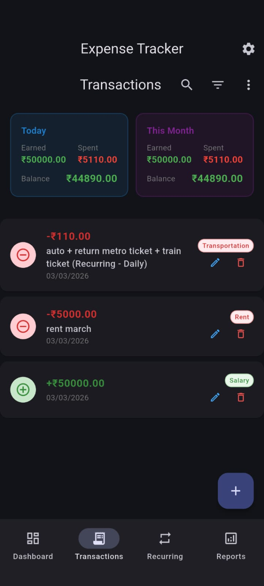
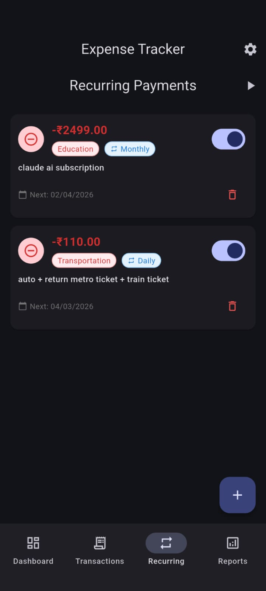
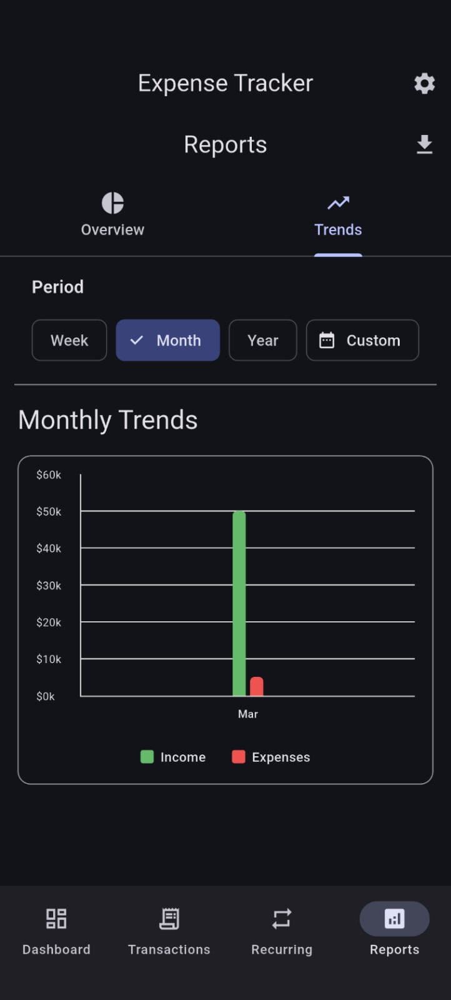
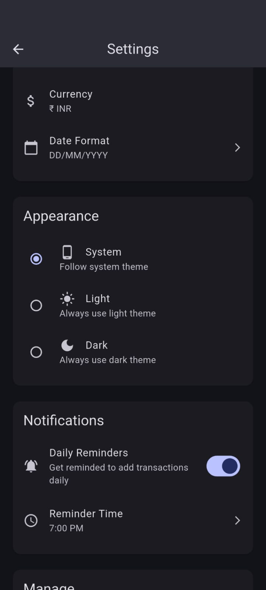
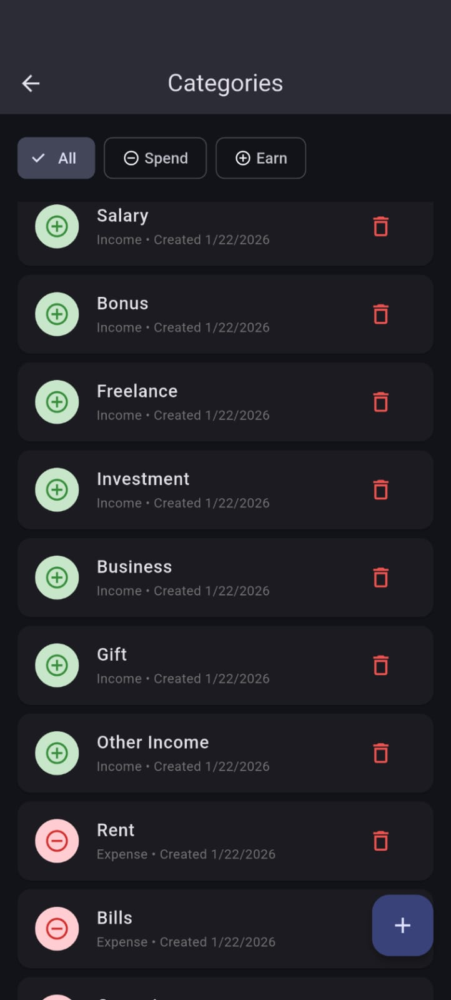

# Offline-First Personal Finance App
### Flutter | Clean Architecture | BLoC | Scalable Architecture

A production-ready personal finance management application built with Flutter using Clean Architecture and the BLoC pattern.

This project demonstrates offline-first design principles, modular feature structure, and scalable architecture suitable for real-world applications and SaaS expansion.

---

## 📱 App Preview









---

## 🎥 Demo Video

Watch the full application walkthrough (YouTube Short):

👉 https://youtube.com/shorts/FEx-jotuJvc?feature=share

---

## 🚀 Problem Statement

Many users require reliable expense tracking even without internet connectivity.  
This application is designed to work fully offline using SQLite, while maintaining an extensible architecture that supports future cloud sync, multi-device support, and subscription-based SaaS expansion.

---

## ✨ Key Features

- ✅ Fully Offline-First (SQLite-based)
- ✅ Clean Architecture (Feature-first modular structure)
- ✅ BLoC State Management
- ✅ CSV Export Support
- ✅ Advanced Reports & Charts
- ✅ Dark / Light Theme Support
- ✅ Scalable for Cloud Sync Expansion
- ✅ Extensible Multi-Currency Support
- ✅ Dependency Injection (get_it)
- ✅ Error Handling with Result Wrapper Pattern

---

## 🏗 Architecture Overview

This project follows **Clean Architecture** with a feature-first modular structure.

### Layers:

### Presentation Layer
- BLoC for state management
- Immutable UI states
- Event-driven architecture

### Domain Layer
- Entities
- UseCases
- Repository contracts

### Data Layer
- Repository implementations
- Local data source (SQLite)
- Migration handling

---

## 🧩 Architecture Diagram


The application follows strict separation of concerns:

Presentation (BLoC)  
↓  
Domain (UseCases)  
↓  
Repository (Contract)  
↓  
Local Data Source (SQLite)

Each layer depends only on abstractions, ensuring scalability, maintainability, and testability.

---

## 📂 Project Structure


```
lib/
├── app.dart                    # App configuration and theme setup
├── main.dart                   # Entry point
├── routes/                     # Navigation and routing
│   └── app_router.dart        # GoRouter configuration
├── core/                       # Core utilities and shared code
│   ├── constants/             # App constants (currencies)
│   ├── db/                    # Database configuration
│   ├── di/                    # Dependency injection setup
│   ├── errors/                # Error handling
│   ├── theme/                 # Theme configuration and cubit
│   └── utils/                 # Utilities (Result, CSV service)
└── features/                   # Feature modules
    ├── categories/            # Category management
    │   ├── data/             # Data layer (models, repositories)
    │   ├── domain/           # Business logic (entities, usecases)
    │   └── presentation/     # UI layer (bloc, pages, widgets)
    ├── home/                  # Home dashboard
    ├── onboarding/           # First-run setup
    ├── reports/              # Analytics and reports
    ├── settings/             # App settings
    └── transactions/         # Transaction management
```


